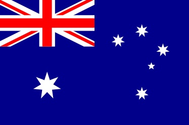
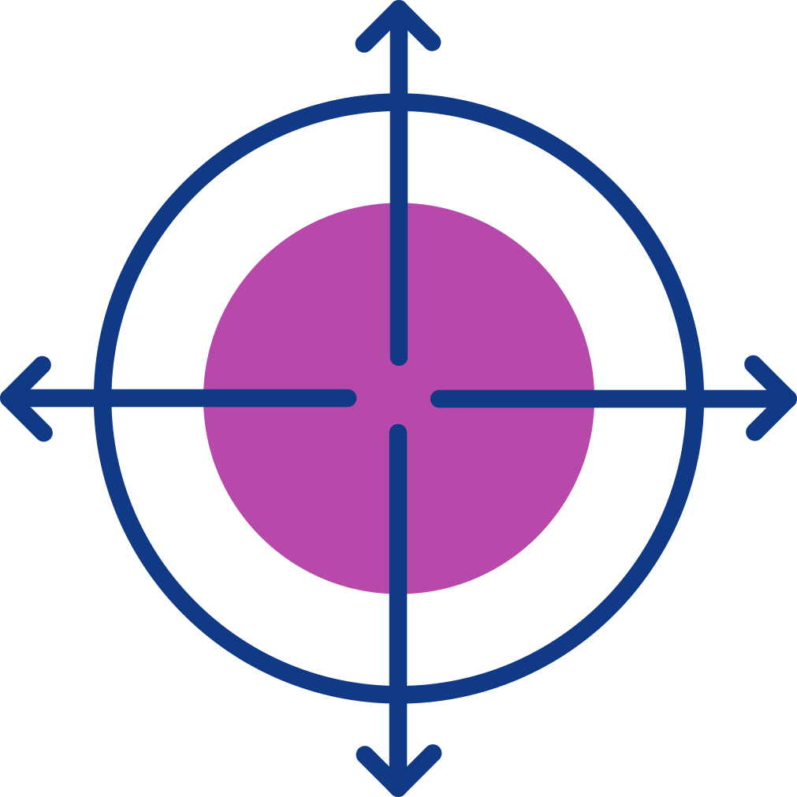
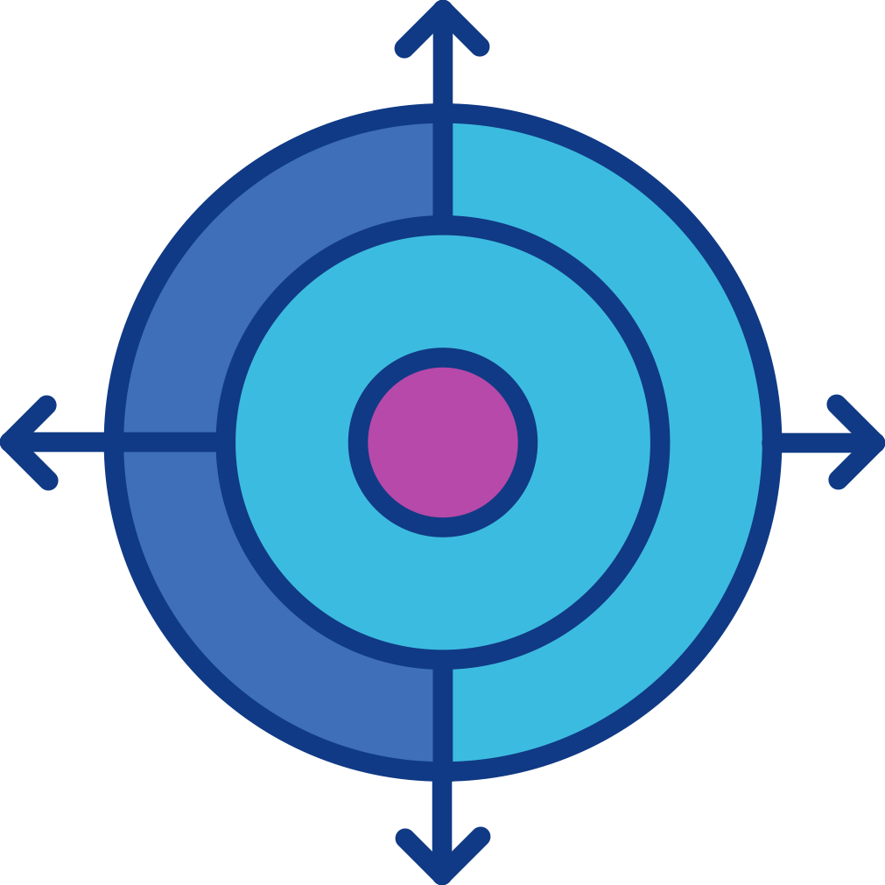

# Doop UX — Quote Generation Guideline

> How to turn any plain `.md` brief into a branded Doop UX proposal HTML.

---

## 1. File Naming & Location

- **Location:** `/quotes/` (same directory as `northgate-003.html`, `ralph-001.html`, etc.)
- **Naming convention:** `[client-slug]-[version].html`
  - `client-slug`: lowercase, no spaces, kebab-case if needed  
    *(e.g. `lovebite`, `northgate`, `ralph`, `smith-co`)*
  - `version`: 3-digit zero-padded, incremental per client  
    *(001, 002, 003…)*
  - First quote for a client → `001`. Revisions → increment.
- **Examples:**
  - `lovebite-001.html`
  - `northgate-003.html`
  - `acme-corp-001.html`

---

## 2. Template Source

The canonical style reference is **`northgate-003.html`**.

- Copy the **entire** `<style>` block and HTML skeleton from that file.
- Do **not** modify the CSS. Only swap content.
- If a component doesn't exist in `northgate-003.html`, derive it from `ralph-002.html` or `lovebite-002.html` — but keep the same design tokens (colors, radii, spacing, font).

---

## 3. Assets (Relative Paths Only)

All image `src` attributes must point to the local `assets/` folder inside `/quotes/`:

```html



```

### Available icons in `quotes/assets/`
| File | Common Use |
|---|---|
| `icons_0000_Layer-8.png` | Generic / Misc |
| `icons_0001_Layer-7.png` | Development / Build |
| `icons_0002_Layer-6.png` | SEO / Search |
| `icons_0003_Layer-5.png` | AI / Automation / Future-proofing |
| `icons_0004_Layer-4.png` | Web App / Product |
| `icons_0005_Layer-3.png` | Design / UX |
| `icons_0006_Layer-2.png` | Strategy / Growth |
| `icons_0007_Layer-1.png` | Brand / Identity |

> If the required icon is missing from `quotes/assets/`, copy it from `../assets/` (project root) into `quotes/assets/` before referencing it.

### Flags (footer)
- `assets/australia.png`
- `assets/germany.png`
- `assets/argentina.png`

---

## 4. Header & Footer (Fixed / Never Change)

### Header
- Logo links to `https://doopux.com`
- `brand-subtitle` reflects the proposal type (e.g. *SEO Proposal*, *Web App Proposal*, *UX Proposal*)
- `brand-icon-wrap` holds a 46×46px icon matching the proposal type

### Footer
- Same 3 locations with flags
- `hello@doopux.com`
- `Copyright © 2026 Doop UX`

**Never modify header or footer branding.** Only the subtitle and icon may change per quote.

---

## 5. Content Mapping — Markdown → HTML

### Hero

| Markdown | HTML |
|---|---|
| `# Client — Project Name` | `<h1>Project Name<br>for Client</h1>` |
| Intro / one-liner | `<p class="hero-sub">Prepared by Doop UX · domain.com</p>` |
| Date | `<span class="hero-date">Month Year</span>` |
| Tag | `<span class="hero-tag"><span class="dot">•</span> Quote</span>` (always) |

### Sections

| Markdown | HTML Component |
|---|---|
| `## Section Title` | White `.card` with `.section-eyebrow` + `<h2>` |
| `### Subsection` | `<h3 class="sub">` inside a card |
| Feature / deliverable list | `.check-list` (green ✓) |
| Detail / note / explanation list | `.item-list` (purple dot ·) |
| Exclusions / negative points | `.cross-list` (grey ×) |
| Numbered steps / process | `.numbered-list` (purple numbered circles) |
| `### Phase 1 — Name` | `.phase-card` (dark header) |
| `> 💡` tip / key insight | `.highlight-box` (purple gradient) |
| Disclaimer / "does not include" | `.notice.notice-amber` (yellow) |
| Positive confirmation / go-ahead | `.notice.notice-green` (green) |
| Pricing table | `.tf-table` |

### When to use which list style
- **`.check-list`** — Features the client *gets*, deliverables, completed work, weekly activities.
- **`.item-list`** — Explanations, details, process notes, technical specs, privacy rules.
- **`.cross-list`** — Explicitly excluded items (rare; only if the MD calls out negatives).
- **`.numbered-list`** — Next steps, sequential process, onboarding flow.

### When to use which callout
- **`.highlight-box`** — Single standout facts: price, timeline summary, key metric.
- **`.notice-amber`** — Disclaimers, scope exclusions, month-to-month clauses, caveats.
- **`.notice-green`** — Positive confirmations, post-launch support windows, approvals.

---

## 6. Phase Cards (Dark Headers)

Use `.phase-card` for every major pricing tier or project phase:

```html
<div class="phase-card">
  <div class="phase-icon">
    
  </div>
  <div>
    <p class="phase-eyebrow c-accent">Phase 1 · One-Time</p>
    <p class="phase-title">MVP</p>
  </div>
</div>
```

Eyebrow color classes:
- `.c-accent` (pink) — Phase 1, core work, one-time
- `.c-purple` — Phase 2, ongoing, retainer
- `.c-teal` — Optional add-ons, future phases

Optional badge inside phase-card (for optional items):
```html
<span class="badge badge-scope" style="flex-shrink:0;">Optional</span>
```

---

## 7. `<title>` Tag Format

```html
<title>[Type] Quote - [Client] [Project]</title>
```

Examples:
- `<title>SEO Quote - Northgate Building Group</title>`
- `<title>Web App Quote - Lovebite Speed Dating</title>`
- `<title>UX Proposal - Ralph Kerle's Art</title>`

---

## 8. Process Checklist (Agent Workflow)

When the user drops a new `.md` file and says *"quote"*:

1. **Read** the `.md` fully.
2. **Determine client slug** from the content or ask if ambiguous.
3. **Find the latest version** for that client by listing `/quotes/*.html`.
4. **Copy the HTML skeleton** from `northgate-003.html` (full `<style>` + structure).
5. **Map content** section by section using the table in §5.
6. **Pick icons** that match the proposal type and phases.
7. **Ensure icons exist** in `quotes/assets/`; copy from `../assets/` if missing.
8. **Set relative paths** (`src="assets/..."`) for all images.
9. **Write** to `/quotes/[client]-[version].html`.
10. **Confirm** the file path and version number with the user.

---

## 9. Quick Reference — Existing Quotes

| File | Client | Type | Version |
|---|---|---|---|
| `northgate-003.html` | Northgate Building Group | SEO | 003 |
| `ralph-001.html` | Ralph Kerle | UX / Art | 001 |
| `ralph-002.html` | Ralph Kerle | UX / Art | 002 |
| `lovebite-002.html` | Lovebite | Web App | 002 |

Use these as structural examples if a quote needs a layout not present in `northgate-003.html`.
